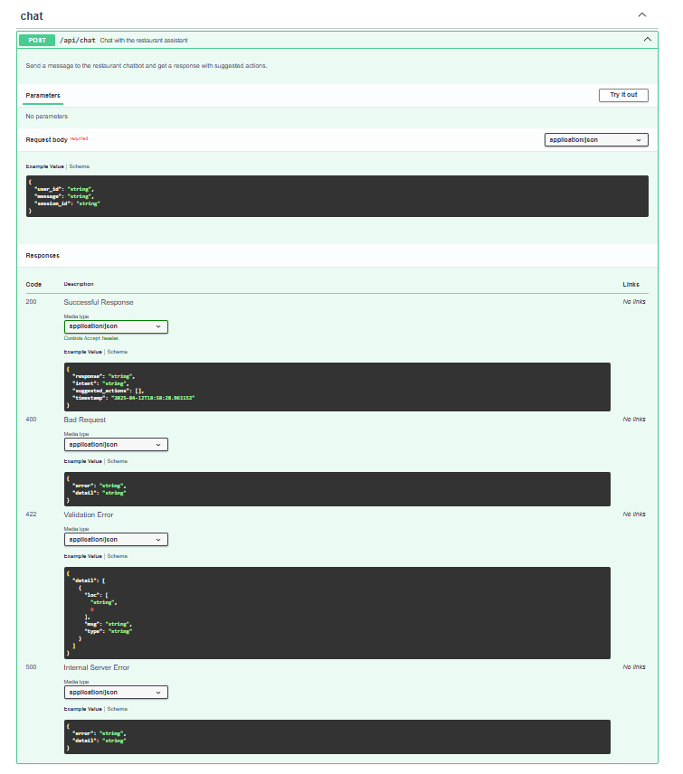
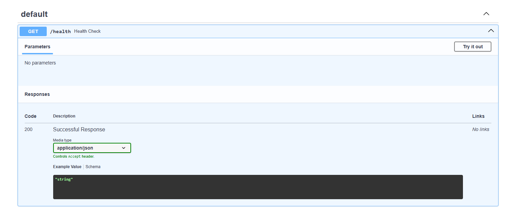
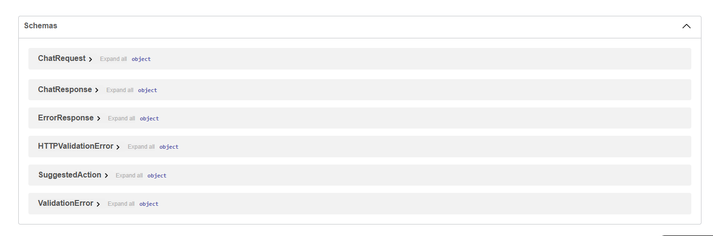

# Savory Haven Restaurant Chatbot API Documentation

## API Overview

The Savory Haven Restaurant Chatbot API provides endpoints to interact with the restaurant's conversational AI system. The API allows users to get information about the menu, make reservations, and get answers to common questions about the restaurant.

## Base URL

```
http://localhost:8000
```

## Authentication

Currently, the API does not require authentication for basic usage.

## Endpoints

### 1. Health Check

**Endpoint:** `GET /health`

**Description:** Check if the API is running properly.

**Response Example:**
```json
{
  "status": "healthy",
  "service": "Savory Haven Restaurant Chatbot"
}
```

### 2. Chat with Restaurant Assistant

**Endpoint:** `POST /api/chat`

**Description:** Send a message to the restaurant chatbot and get a response with suggested actions.

**Request Body:**
```json
{
  "user_id": "user123",
  "message": "Do you have any vegetarian options on the menu?",
  "session_id": "session456"
}
```

**Request Parameters:**
- `user_id` (string, required): A unique identifier for the user
- `message` (string, required): The user's message to the chatbot
- `session_id` (string, required): A unique identifier for the conversation session

**Response Example:**
```json
{
  "response": "Yes, we have several vegetarian options including our Bruschetta Classica, Caprese Salad, and Quattro Formaggi Pizza. Would you like more details about any of these dishes?",
  "intent": "menu_inquiry",
  "suggested_actions": [
    {
      "action_type": "view_menu",
      "label": "View Full Menu",
      "value": "full_menu"
    },
    {
      "action_type": "filter_menu",
      "label": "Filter by Category",
      "value": "categories"
    }
  ],
  "timestamp": "2023-07-15T14:32:10Z"
}
```

**Response Fields:**
- `response` (string): The chatbot's response to the user's message
- `intent` (string): The detected intent of the user's message (e.g., menu_inquiry, reservation_request)
- `suggested_actions` (array): List of suggested actions that the user can take
  - `action_type` (string): Type of action (e.g., view_menu, make_reservation)
  - `label` (string): Display label for the action
  - `value` (string): Value associated with the action
- `timestamp` (string): ISO 8601 timestamp of when the response was generated

## Error Responses

### 400 Bad Request

```json
{
  "detail": "Invalid request parameters"
}
```

### 500 Internal Server Error

```json
{
  "detail": "An unexpected error occurred"
}
```

## Swagger UI Screenshots

### API Documentation Page


### Chat Endpoint Documentation


### Health Endpoint Documentation


### Schema Documentation


## Test Scenarios

### 1. Menu Inquiry
**Request:**
```json
{
  "user_id": "test_user_1",
  "message": "What vegetarian options do you have on the menu?",
  "session_id": "test_session_1"
}
```

**Response:**
```json
{
  "response": "Certainly! At Savory Haven, we have several delicious vegetarian options. Let me highlight a couple for you:\n\nFrom our Antipasti (traditional Italian starters) selection, we have the **Bruschetta Classica** for $9.50. This features toasted artisan bread topped with vine-ripened tomatoes, fresh basil, garlic, and extra virgin olive oil. It's a light and flavorful way to begin your meal. This is a popular item and a chef's recommendation!\n\nAs for our pizzas, we offer the **Quattro Formaggi** for $18.95. This is a white pizza featuring a delightful blend of mozzarella, gorgonzola, fontina, and parmigiano cheeses.\n\nWould you like me to explore other vegetarian options or provide more details on these dishes?\n",
  "intent": "menu_inquiry",
  "suggested_actions": [
    {
      "action_type": "view_menu",
      "label": "View Full Menu",
      "value": "full_menu"
    },
    {
      "action_type": "filter_menu",
      "label": "Filter by Category",
      "value": "categories"
    }
  ],
  "timestamp": "2023-07-15T14:32:10Z"
}
```

### 2. Reservation Request
**Request:**
```json
{
  "user_id": "test_user_2",
  "message": "I'd like to make a reservation for 4 people tomorrow at 7 PM",
  "session_id": "test_session_2"
}
```

**Response:**
```json
{
  "response": "Okay, I can help you with that! To confirm, you'd like to make a reservation for 4 people tomorrow at 7 PM.\n\nCould you please tell me what day of the week \"tomorrow\" is? Also, can I get a name for the reservation?\n",
  "intent": "reservation_request",
  "suggested_actions": [
    {
      "action_type": "make_reservation",
      "label": "Make Reservation",
      "value": "reservation_form"
    }
  ],
  "timestamp": "2023-07-15T14:32:10Z"
}
```

### 3. Hours and Location
**Request:**
```json
{
  "user_id": "test_user_3",
  "message": "What are your opening hours and where are you located?",
  "session_id": "test_session_3"
}
```

**Response:**
```json
{
  "response": "Savory Haven is located at 789 Gourmet Avenue, Flavor Town, CA 90210.\n\nOur opening hours are:\n\n*   **Monday:** 11:00 - 22:00\n*   **Tuesday:** 11:00 - 22:00\n*   **Wednesday:** 11:00 - 22:00\n*   **Thursday:** 11:00 - 23:00\n*   **Friday:** 11:00 - 00:00\n*   **Saturday:** 10:00 - 00:00\n*   **Sunday:** 10:00 - 21:00",
  "intent": "hours_location",
  "suggested_actions": [
    {
      "action_type": "view_hours",
      "label": "View Opening Hours",
      "value": "hours"
    }
  ],
  "timestamp": "2023-07-15T14:32:10Z"
}
```

### 4. Special Events
**Request:**
```json
{
  "user_id": "test_user_4",
  "message": "Are there any special events or promotions happening this week?",
  "session_id": "test_session_4"
}
```

**Response:**
```json
{
  "response": "Yes, there is a special event this week. Every Monday evening, all pasta dishes are 20% off. We also have happy hour Monday through Thursday from 4:00 PM to 6:00 PM with $5 select appetizers, $2 off all cocktails, and half-price wine by the glass.\n",
  "intent": "special_events",
  "suggested_actions": [],
  "timestamp": "2023-07-15T14:32:10Z"
}
```

## Database Schema

The restaurant chatbot uses MongoDB with the following collections:

1. **menu_items**: Stores information about menu items
2. **restaurant_info**: Stores general information about the restaurant
3. **reservations**: Stores reservation information
4. **conversations**: Stores conversation history

## NLP Components

The chatbot uses the following NLP components:
1. **Intent Recognition**: Identifies the purpose of the user's message
2. **RAG (Retrieval Augmented Generation)**: Retrieves relevant information and generates responses
3. **Embedding Model**: Converts text to vector embeddings for semantic search 

## Docker Deployment

The Savory Haven Restaurant Chatbot is containerized using Docker for easy deployment and scalability.

### Docker Configuration

The project includes the following Docker-related files:
- **Dockerfile**: Contains instructions for building the application container
- **Dockerfile.demo**: A streamlined version for demonstration purposes
- **docker-compose.yml**: Orchestrates the application and MongoDB services

### Building and Running with Docker

The application can be built and run using Docker with these commands:

```
# Build the Docker image
docker build -t savory-haven-demo -f Dockerfile.demo .

# Run the container
docker run -d -p 8000:8000 --name savory-haven-app savory-haven-demo
```

Alternatively, using Docker Compose:

```
# Build and start services
docker compose up -d

# Check logs
docker compose logs app

# Stop services
docker compose down
```

### Docker Architecture

The Docker setup includes:
- **Web Service Container**: Running the FastAPI application
- **MongoDB Container**: For persistent data storage
- **Volume Mapping**: For vector store persistence

## Render Deployment

The Savory Haven Restaurant Chatbot is deployed on Render, a cloud platform for hosting web services.

### Deployment Configuration

The application is deployed with these settings:
- **Service Type**: Web Service
- **Environment**: Docker
- **Region**: Oregon (US West)
- **Branch**: main
- **Instance Type**: Free
- **Health Check Path**: /health
- **Dockerfile Path**: ./Dockerfile.demo

### Live Deployment

The application is deployed and accessible at:

```
https://savory-haven-chatbot.onrender.com
```

API endpoints:
- **API Documentation**: [https://savory-haven-chatbot.onrender.com/docs](https://savory-haven-chatbot.onrender.com/docs)
- **Health Check**: [https://savory-haven-chatbot.onrender.com/health](https://savory-haven-chatbot.onrender.com/health)
- **Chat Endpoint**: `https://savory-haven-chatbot.onrender.com/api/chat` (POST)

### Deployment Screenshots

The application has been successfully deployed on Render and is fully operational, as shown in the Swagger UI screenshots above.

## Conclusion

The Savory Haven Restaurant Chatbot provides a robust API for interacting with a restaurant conversational AI system. It handles various user intents related to restaurant operations, provides contextual responses, and offers suggested actions to enhance the user experience.

The system is built with scalability in mind, uses modern NLP techniques, and is deployed using Docker and Render for reliability and ease of maintenance. 